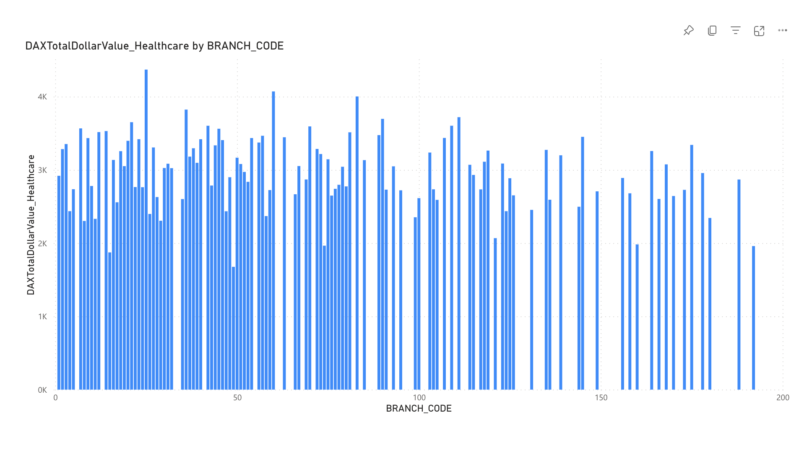

# Capstone_project
Data Analytics - Capstone Project 
## Project Description					
This project is a comprehensive data analytics solution developed as the capstone project for the Perscholas  bootcamp. The project focuses on extracting credit card data from various sources, transforming it using Apache Spark, loading it into a MySQL database, and visualizing the results through Power BI
			
### Key Features:
Data ingestion module to extract credit data from JSON files and RESTful APIs
Apache Spark for performing complex data transformations and data quality checks
MySQL database for efficient storage of transformed financial data
Interactive visualizations and dashboards created using PowerBI

### Technologies Used:
- Python
- Apache Spark
- MySQL
- Power BI
- Git

## Credit Card Dataset Overview
The Credit Card System database is an independent system developed for managing activities such as registering new customers and approving or canceling requests, etc., using the architecture.
A credit card is issued to users to enact the payment system. It allows the cardholder to access financial services in exchange for the holder's promise to pay for them later. Below are three files that contain the customer’s transaction information and inventories in the credit card information.

- CDW_SAPP_CUSTOMER.JSON: This file has the existing customer details.
- CDW_SAPP_CREDITCARD.JSON: This file contains all credit card transaction information.
- CDW_SAPP_BRANCH.JSON: Each branch’s information and details are recorded in this
file.

## 1.Functional Requirements - Load Credit Card Database (SQL) 
						
### Data Extraction and Transformation with Python and PySpark 
				
### Functional Requirement 1.1 
a. For “Credit Card System,” create a Python and PySpark SQL program to read/extract the following JSON files according to the specifications found in the mapping document.				
-  CDW_SAPP_BRANCH.JSON
-  CDW_SAPP_CREDITCARD.JSON 
-  CDW_SAPP_CUSTOMER.JSON
  ### Req-1.2 						
Data loading into Database 					
### Function Requirement 1.2
Once PySpark reads data from JSON files, and then utilizes Python, PySpark, and Python modules to load data into RDBMS(SQL),
perform the following:

a.  Create a Database in SQL(MySQL), named “creditcard_capstone.”
 				
b.  Create a Python and Pyspark Program to load/write the “Credit
 								
Card System Data” into RDBMS(creditcard_capstone).
 							
						 						
Tables should be created by the following names in RDBMS: 

 CDW_SAPP_BRANCH
 
 CDW_SAPP_CREDIT_CARD
 
 CDW_SAPP_CUSTOMER 
 
### 2. Functional Requirements - Application Front-End
						
Once data is loaded into the database, we need a front-end (console) to see/display data. For that, create a console-based Python program to satisfy System Requirements 2 (2.1 and 2.2).
      
### 2.1 Transaction Details Module 	

Functional Requirements 2.1 
1) Used to display the transactions made by customers living in a given zip code for a given month and year.
 Order by day in descending order.

2) Used to display the number and total values of transactions for a given type.

3) Used to display the total number and total values of transactions for branches in a given state.

   # 2.2 Customer Details Module 					
##Functional Requirements 2.2 

1) Used to check the existing account details of a customer.

2) Used to modify the existing account details of a customer.
    
3) Used to generate a monthly bill for a credit card number for a given month and year

4) Used to display the transactions made by a customer between two dates. Order by year, month, and day in descending order.
 
# 3. Functional Requirements - Data Analysis and Visualization
						
After data is loaded into the database, users can make changes from the front end, and they can also view data from the front end. Now, the business analyst team wants to analyze and visualize the data.
Use Power BI for the below requirements:

## Functional Requirements 3.1 
				
Export following tables as a CSV file, using this link: https://dev.mysql.com/doc/workbench/en/wb-admin-export-import-table.html 
-CDW_SAPP_BRANCH
-CDW_SAPP_CREDIT_CARD
-CDW_SAPP_CUSTOMER 

Import all CSV files into Power BI.

## Functional Requirements 3.2 
				
Find and plot which transaction type has a high rate of transactions.
  

## Functional Requirements 3.3 
			
Find and plot which state has a high number of customers. 

 

## Functional Requirements 3.4 
			
Find and plot the sum of all transactions for the top 10 customers, and which customer has the highest transaction amount.
 

# Overview of LOAN Application Data API
						
Banks deal in all home loans. They have a presence across all urban, semi-urban, and rural areas. Customers first apply for a home loan; after that, a company will validate the customer's eligibility for a loan.
Banks want to automate the loan eligibility process (in realtime) based on customer details provided while filling out the online application form. These details are Gender, Marital Status, Education, Number of Dependents, Income, Loan Amount, Credit History, and others. To automate this process, they have the task of identifying the customer segments to those who are eligible for loan amounts so that they can specifically target these customers. 
Here they have provided a partial dataset.
# API Endpoint:
https://raw.githubusercontent.com/platformps/LoanDataset/main/loan_data.json
						
The above URL allows you to access information for loan application information. This dataset has all of the required fields for a loan application. You can access data from a REST API by sending an HTTP request and processing the response

## 4. Functional Requirements - LOAN Application Dataset 
					
### Functional Requirements 4.1 
					
Create a Python program to GET (consume) data from the above API endpoint for the loan application dataset. 
					
### Functional Requirements 4.2 
				
						
Find the status code of the above API endpoint. 
					
### Functional Requirements 4.3 
				
						
Once Python reads data from the API, utilize PySpark to load data into RDBMS (SQL). 
The table name should be CDW-SAPP_loan_application in the database. 
		
## 5. Functional Requirements - Data Analysis and Visualization for LOAN Application
						
After the data is loaded into the database, the business analyst team wants to analyze and visualize the data.
						
Use Power BI for the below requirements:

## Functional Requirements 5.1 
					
Export  “CDW-SAPP_loan_application” table as a CSV file, 
click the link for instructions: https://dev.mysql.com/doc/workbench/en/wb-admin-export-import-table.html 
Import the CSV file into Power BI.

## Functional Requirements 5.2 
					
Find and plot the percentage of applications approved for self-employed applicants.

## Functional Requirements 5.3 
					
Find the percentage of rejection for married male applicants.

## Functional Requirements 5.4 

Find and plot the top three months with the largest transaction data. 

## Functional Requirements 5.5 
						
Find and plot which branch processed the highest total dollar value of healthcare transactions.

